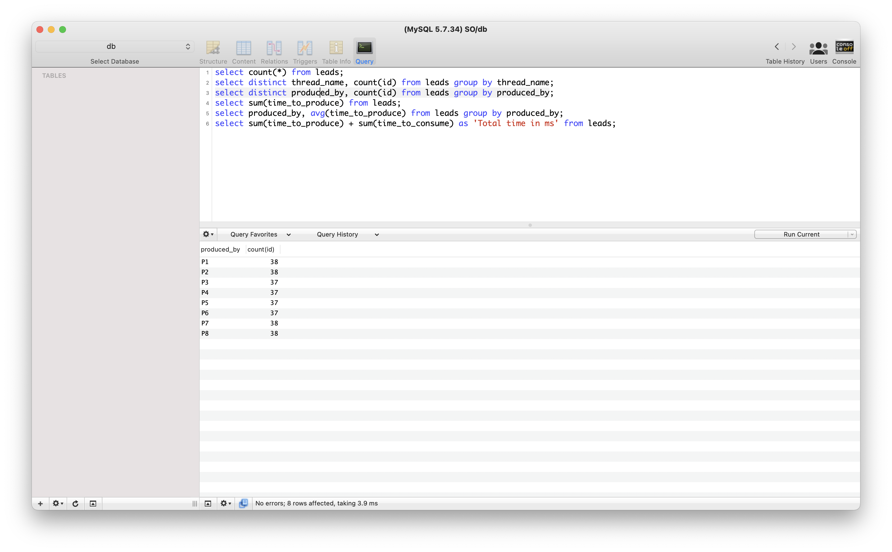
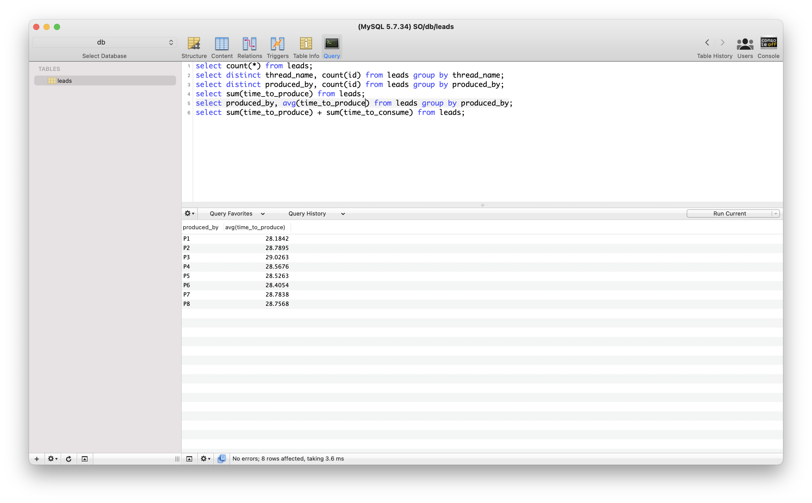
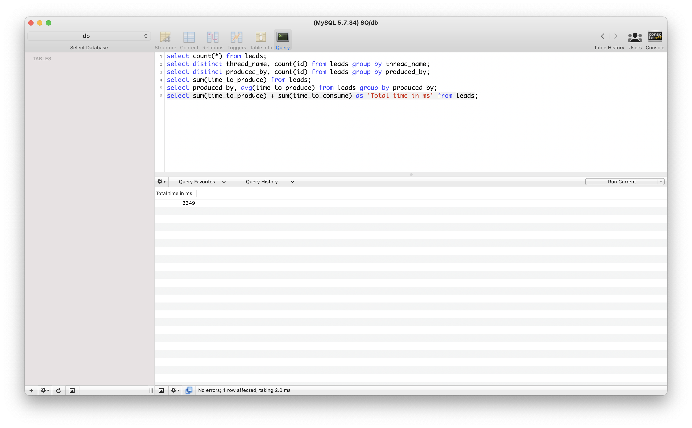

# ProyectoFinal Sistemas Operativos

## Pregunta 1
Cuantos leads compró cada consumidor

## Pregunta 2
Cuantos leads creó cada productor

## Pregunta 3
Cuanto tiempo promedio se tardó cada productor en producir un elemento

## Pregunta 4
Cuanto tiempo le lleva a todo el sistema terminar de producir y consumir

## Pregunta 5
Cuanto tiempo tarde en terminar el sistema en un modelo de alternancia
